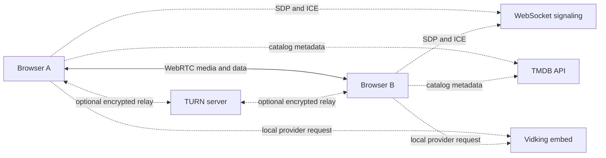

<p align="center">
  
</p>

<h1 align="center">PairBeam</h1>

<p align="center">
  One link. Two peers. No account.
</p>

PairBeam is a database-free WebRTC room for two people to call, share screens or a local movie, and chat from their browsers. Rooms are temporary, messages stay in memory, and either participant can share content—even at the same time.

## What it does

- Starts a private two-person room without sign-up or installation
- Supports microphone, camera, and simultaneous two-way screen sharing
- Streams a compatible movie selected from the host computer, or synchronizes a direct media URL when browser capture is blocked
- Searches TMDB movie and TV metadata directly from the browser, including season and episode browsing, without adding a PairBeam database or catalog backend
- Includes an experimental Chrome/Chromium and Firefox companion extension that can synchronize a consented Vidking movie or exact TV episode without relaying provider media through PairBeam
- Gives the movie host play, pause, seek, and stop controls with 24/30fps adaptive quality
- Shows synchronized movie controls to both participants so either person can play, pause, seek, toggle an added SRT subtitle, or request an exposed audio-track change
- Preserves native movie aspect ratios in fullscreen with a true-black shared-content stage and explicit Fit, Crop, and 100% viewing modes
- Lets each participant independently choose whose screen to view
- Returns to the participant camera or avatar when a share ends
- Offers adaptive Auto quality plus native, 1080p60, 720p60, and 480p30 sharing presets
- Includes a distraction-free presentation mode with Fit, Crop, and scrollable 100% screen views
- Sends microphone and shared-content audio independently, and can use an exposed PipeWire/PulseAudio monitor on Linux
- Lets each listener independently adjust participant voice, shared-screen audio, and shared-movie audio without changing what the other person hears
- Floats the participant, local camera, or active video above the desktop with browser Picture-in-Picture support
- Keeps chat available beside fullscreen content without covering the shared screen
- Shows actual screen capture/encoded resolution, FPS, bitrate, connection health, and direct or TURN-relayed status
- Reconnects signaling and lets a participant rejoin the same temporary room

## How it works



The signaling server coordinates room membership and forwards WebRTC setup messages. Audio, video, screen content, and chat do not pass through that signaling server. WebRTC first attempts a direct route; when a direct connection is unavailable, a configured TURN server can relay the encrypted WebRTC traffic.

Room membership exists only in the signaling server's process memory. PairBeam has no application database, accounts, stored chat history, call recordings, or analytics tied to persistent user identities.

## Technology

| Area | Stack |
| --- | --- |
| Interface | React 19, Vite, Tailwind CSS v4 |
| Components | Local shadcn-style primitives using Radix UI |
| Calls and sharing | WebRTC media transceivers |
| Chat and call controls | WebRTC data channel |
| Catalog metadata | Direct browser requests to TMDB |
| Experimental provider sync | Cross-browser MV3 companion extension for desktop Chrome/Chromium and Firefox |
| Signaling | Node.js, Express, and WebSocket |
| Persistence | None |

## Run locally

### Requirements

- Node.js 20.19+ or 22.12+
- A modern browser with WebRTC and screen-capture support; local-file movie relay requires media-element `captureStream()` support, while a direct media URL can fall back to both browsers loading it independently
- The [PairBeam signaling server](https://github.com/benson09121/WebRTC-screenshare-backend)

Place the frontend and backend repositories beside each other, then start them in separate terminals.

```bash
# Terminal 1 — signaling server
cd WebRTC-screenshare-backend
npm install
node server.js
```

```bash
# Terminal 2 — web app
cd WebRTC-screenshare-frontend
npm install
npm run dev
```

Open the local URL printed by Vite, create a room, and send the generated room link to the other participant. The local signaling default is the current hostname on port `9080`.

## Environment variables

Create a `.env.local` file in the frontend repository when the signaling or TURN services are hosted elsewhere:

```dotenv
VITE_WS_URL=wss://signal.example.com
VITE_TMDB_READ_ACCESS_TOKEN=tmdb-application-read-token
VITE_STUN_URLS=stun:stun.example.com:3478
VITE_TURN_URLS=turn:turn.example.com:3478?transport=udp,turns:turn.example.com:443?transport=tcp
VITE_TURN_USERNAME=deployment-username
VITE_TURN_PASSWORD=deployment-credential
```

`VITE_STUN_URLS` and `VITE_TURN_URLS` accept comma-separated URLs; the singular `VITE_TURN_URL` remains supported. TURN is optional during local development but strongly recommended for production reliability across restrictive networks. Use short-lived TURN credentials where your provider supports them, and never commit credentials to the repository.

The catalog intentionally runs entirely in the frontend. `VITE_TMDB_READ_ACCESS_TOKEN` is therefore embedded in the public Vite bundle and visible to visitors. Use only a restricted, replaceable TMDB application read token—never a TMDB user/session credential. Catalog results are metadata only and do not imply that PairBeam or another provider can play that title.

Vidking does not expose the complete inbound play/pause/seek contract PairBeam needs from an ordinary cross-origin page. The repository therefore includes a cross-browser MV3 companion-extension prototype for controlled personal testing. PairBeam detects desktop Firefox versus Chrome/Chromium and offers the matching ZIP and instructions. One audited bridge implementation is packaged with separate manifests: Chromium receives `background.service_worker`, while Firefox receives `background.scripts`. The extension observes the provider's ordinary video element and transports only playback commands through PairBeam. It does not extract, proxy, download, or WebRTC-relay provider media. Vidsrc.sbs remains unsupported because its changing nested player origins have not passed this control and security model. Technical embeddability does not establish content distribution rights.

## Test the experimental Vidking synchronization

Both participants must use desktop Firefox or Chrome/Chromium and manually load the extension. They may use different supported browsers. PairBeam detects the current browser locally and presents the matching download.

Chrome/Chromium:

1. Download and extract `pairbeam-extension.zip` from PairBeam.
2. Open `chrome://extensions` and enable **Developer mode**.
3. Choose **Load unpacked** and select the extracted `extension` folder containing `manifest.json`.
4. Reload PairBeam in both browsers.

Firefox:

1. Download `pairbeam-firefox-extension.zip` from PairBeam and keep it intact.
2. Open `about:debugging#/runtime/this-firefox`.
3. Choose **Load Temporary Add-on** and select the downloaded ZIP itself. Its `manifest.json` is packaged at the archive root as Firefox requires.
4. Reload PairBeam. Firefox removes a temporary add-on when the browser restarts, so repeat this temporary-load step after a restart.

After installation, join the same room and open **Share a movie → Browse catalog**. Select a movie, or select a TV series followed by an exact season and episode. The other participant reviews the third-party disclosure and accepts the invitation.

PairBeam does not trigger installation and does not distribute a `.crx`; privately packed CRX files can be rejected with `CRX_REQUIRED_PROOF_MISSING`. Standard Firefox also blocks permanent unsigned add-ons, so this personal build uses Mozilla's temporary debugging installation flow; permanent Firefox distribution would require Mozilla signing, even if distributed privately. If PairBeam uses a custom production domain, first add its exact HTTPS match pattern to `extension/manifest.json`. After installing or changing the allowed origin, reload the extension and PairBeam. The ZIPs contain neither a private signing key nor hidden installation code.

The proposer is the authoritative player. Actions from the other participant are requests applied by that player and then broadcast back with an increasing revision. Volume remains local, so each participant can choose a different level. Autoplay policy may require each person to click the provider player once. See the [extension test notes](./extension/README.md) for current limitations.

TV proposals include the TMDB series ID, exact season and episode numbers, and episode title. Each participant independently loads the same Vidking `/embed/tv/{tmdbId}/{season}/{episode}` route; PairBeam sends only the validated identity and synchronized playback state.

While an episode is playing, use the arrow on the left edge to open the episode selector. The drawer includes every available season and episode and works with keyboard focus and Escape. Either participant may choose an episode; the proposer remains authoritative and broadcasts a media revision so both players switch together without accepting late timestamps from the previous episode.

Timeline seeking uses a short synchronization barrier: playback pauses, the authority publishes the selected timestamp, both players get 900 ms to settle, and playback resumes only if it was playing before the seek. A movie that was already paused remains paused after seeking.

An accepted external watch session is independent from the signaling socket lifecycle. If Render replaces or briefly interrupts the WebSocket, PairBeam keeps the Vidking iframe mounted while rebuilding WebRTC and exchanges a validated recovery snapshot when the replacement data channel opens. The playback authority continues recording its local clock while that channel is unavailable, so the recovery snapshot can correct drift instead of returning both players to an old timestamp. The backend holds an interrupted peer's ephemeral room seat for 30 seconds by default. Even a confirmed peer departure no longer destroys a movie already playing locally: the provider remains visible until the user explicitly selects **Stop watching** or ends the room, and synchronization can recover if the peer returns. A successful `101 Switching Protocols` response is the expected WebSocket reconnection handshake, not an application error.

Vidking rejects iframe sandbox restrictions, so PairBeam does not add an incompatible `sandbox` attribute to this experimental embed. Extension version 0.4.2 splits the Chrome and Firefox background manifests, packages Firefox's `manifest.json` at the ZIP root, and restores active-session state whenever a suspended background context registers again. If an installed extension is reloaded while a PairBeam room remains open, the stale content script now asks the user to reload the room instead of throwing an uncaught context-invalidated error. The extension also retains coordinated seeking and closes new top-level targets created by provider subframes during an accepted watch session. This is popup-tab protection, not generic ad removal: advertising rendered inside the player is controlled by the provider and is not scraped or hidden by PairBeam.

Use PairBeam's labelled top-right **Fullscreen** button for the integrated watch-party view. It fullscreens the PairBeam root so chat, episode navigation, the participant camera, and the bottom call dashboard stay available. Native fullscreen permission is intentionally not granted to the cross-origin provider frame because the browser would place that frame above every PairBeam control. In fullscreen, the bottom-center arrow controls the mic, camera, screen-share, movie, and leave dashboard. After three seconds without pointer or keyboard activity, the chat launcher or panel, episode trigger, dashboard and its arrow, plus the fullscreen and stop-watching actions fade out and stop accepting input; a hidden chat panel also releases its reserved stage space. Activity anywhere in PairBeam or inside the provider player restores them. In the ordinary room, opening chat overlays playback without shrinking the stage. The participant camera can be dragged within the stage, while focusing it requires the explicit Focus button so a drag cannot accidentally replace the movie.

Room surfaces share a short reduced-motion-aware animation system: chat and source selection ease rather than snap, catalog dialogs complete their fade/scale exit before unmounting, episode drawers slide from their edge with a restrained settle, and settings popovers expand from their trigger.

## Production notes

- Serve the frontend over HTTPS and signaling over WSS; browser media APIs require a secure context outside localhost.
- Configure TURN before treating connection reliability as production-ready.
- Deploy TURN in regions near the participants, with UDP plus TCP/TLS fallback. A direct connection does not send media through TURN, so moving TURN cannot improve an already-direct 8 ms UDP path.
- Treat a room link as an invitation secret: anyone with the link can try to join until the two-person room is full.
- Signaling handles room identifiers plus SDP/ICE coordination metadata, even though it does not receive call or chat content.
- A TURN server may relay encrypted WebRTC packets when peers cannot connect directly.
- Movie sharing depends on every participating browser being able to decode the selected source. MP4 with H.264/AAC and WebM are the safest choices. For a direct link, PairBeam first attempts host-side capture and WebRTC relay, which requires compatible media CORS headers. If that is blocked but ordinary browser playback succeeds, PairBeam sends the exact URL over the encrypted peer data channel so both participants fetch it and PairBeam synchronizes their controls. URLs that depend on private query tokens should therefore be shared only with a trusted participant. Login-only sources, YouTube, Netflix, and normal webpage URLs should be shared as a browser tab with audio instead.
- Media-element capture can initially return an empty stream; PairBeam waits for decoded video and asynchronously exposed tracks before reporting a format or browser failure.
- Follow TMDB attribution and licensing requirements. The catalog links back to TMDB and identifies TMDB ratings; commercial use requires the appropriate TMDB agreement.

## Verification

```bash
npm test
npm run lint
npm run build
```

The signaling repository includes its own protocol test:

```bash
cd ../WebRTC-screenshare-backend
npm test
```

## Project documentation

- [Product roadmap](./ROADMAP.md)
- [UI and interaction specification](./ui_spec.md)
- [Internship reflection](./INTERNSHIP_REFLECTION.md)

The current roadmap prioritizes safer screen-source replacement, keyboard shortcuts, pre-call device checks, accessibility testing, and stronger production hardening while keeping PairBeam database-free and limited to two participants.

## Contributing

Keep changes aligned with the core constraints: two participants, ephemeral room state, no database, and no server-side media storage. For behavior changes, update the relevant tests and documentation in the same pull request.
