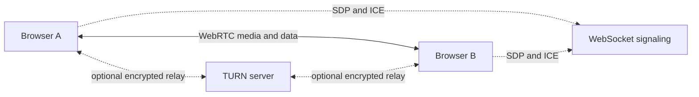

<p align="center">
  
</p>

<h1 align="center">PairBeam</h1>

<p align="center">
  One link. Two peers. No account.
</p>

PairBeam is a database-free WebRTC room for two people to call, share screens or a local movie, and chat from their browsers. Rooms are temporary, messages stay in memory, and either participant can share content—even at the same time.

## What it does

- Starts a private two-person room without sign-up or installation
- Supports microphone, camera, and simultaneous two-way screen sharing
- Streams a compatible movie selected from the host computer or loaded from a direct media URL without uploading it to PairBeam
- Gives the movie host play, pause, seek, and stop controls with 24/30fps adaptive quality
- Lets each participant independently choose whose screen to view
- Returns to the participant camera or avatar when a share ends
- Offers adaptive Auto quality plus native, 1080p60, 720p60, and 480p30 sharing presets
- Includes a distraction-free presentation mode with Fit, Fill, and scrollable 100% screen views
- Sends microphone and shared-content audio independently, and can use an exposed PipeWire/PulseAudio monitor on Linux
- Lets each listener independently adjust participant voice, shared-screen audio, and shared-movie audio without changing what the other person hears
- Floats the participant, local camera, or active video above the desktop with browser Picture-in-Picture support
- Keeps chat available beside fullscreen content without covering the shared screen
- Shows actual screen capture/encoded resolution, FPS, bitrate, connection health, and direct or TURN-relayed status
- Reconnects signaling and lets a participant rejoin the same temporary room

## How it works



The signaling server coordinates room membership and forwards WebRTC setup messages. Audio, video, screen content, and chat do not pass through that signaling server. WebRTC first attempts a direct route; when a direct connection is unavailable, a configured TURN server can relay the encrypted WebRTC traffic.

Room membership exists only in the signaling server's process memory. PairBeam has no application database, accounts, stored chat history, call recordings, or analytics tied to persistent user identities.

## Technology

| Area | Stack |
| --- | --- |
| Interface | React 19, Vite, Tailwind CSS v4 |
| Components | Local shadcn-style primitives using Radix UI |
| Calls and sharing | WebRTC media transceivers |
| Chat and call controls | WebRTC data channel |
| Signaling | Node.js, Express, and WebSocket |
| Persistence | None |

## Run locally

### Requirements

- Node.js 20.19+ or 22.12+
- A modern browser with WebRTC and screen-capture support; local-movie sharing currently requires media-element `captureStream()` support
- The [PairBeam signaling server](https://github.com/benson09121/WebRTC-screenshare-backend)

Place the frontend and backend repositories beside each other, then start them in separate terminals.

```bash
# Terminal 1 — signaling server
cd WebRTC-screenshare-backend
npm install
node server.js
```

```bash
# Terminal 2 — web app
cd WebRTC-screenshare-frontend
npm install
npm run dev
```

Open the local URL printed by Vite, create a room, and send the generated room link to the other participant. The local signaling default is the current hostname on port `9080`.

## Environment variables

Create a `.env.local` file in the frontend repository when the signaling or TURN services are hosted elsewhere:

```dotenv
VITE_WS_URL=wss://signal.example.com
VITE_STUN_URLS=stun:stun.example.com:3478
VITE_TURN_URLS=turn:turn.example.com:3478?transport=udp,turns:turn.example.com:443?transport=tcp
VITE_TURN_USERNAME=deployment-username
VITE_TURN_PASSWORD=deployment-credential
```

`VITE_STUN_URLS` and `VITE_TURN_URLS` accept comma-separated URLs; the singular `VITE_TURN_URL` remains supported. TURN is optional during local development but strongly recommended for production reliability across restrictive networks. Use short-lived TURN credentials where your provider supports them, and never commit credentials to the repository.

## Production notes

- Serve the frontend over HTTPS and signaling over WSS; browser media APIs require a secure context outside localhost.
- Configure TURN before treating connection reliability as production-ready.
- Deploy TURN in regions near the participants, with UDP plus TCP/TLS fallback. A direct connection does not send media through TURN, so moving TURN cannot improve an already-direct 8 ms UDP path.
- Treat a room link as an invitation secret: anyone with the link can try to join until the two-person room is full.
- Signaling handles room identifiers plus SDP/ICE coordination metadata, even though it does not receive call or chat content.
- A TURN server may relay encrypted WebRTC packets when peers cannot connect directly.
- Movie sharing depends on the browser being able to decode the selected source. MP4 with H.264/AAC and WebM are the safest choices. Direct links must be HTTP(S), reachable without login, and served with compatible media CORS headers; YouTube, Netflix, and normal webpage URLs should be shared as a browser tab with audio instead.

## Verification

```bash
npm test
npm run lint
npm run build
```

The signaling repository includes its own protocol test:

```bash
cd ../WebRTC-screenshare-backend
npm test
```

## Project documentation

- [Product roadmap](./ROADMAP.md)
- [UI and interaction specification](./ui_spec.md)
- [Internship reflection](./INTERNSHIP_REFLECTION.md)

The current roadmap prioritizes safer screen-source replacement, keyboard shortcuts, pre-call device checks, accessibility testing, and stronger production hardening while keeping PairBeam database-free and limited to two participants.

## Contributing

Keep changes aligned with the core constraints: two participants, ephemeral room state, no database, and no server-side media storage. For behavior changes, update the relevant tests and documentation in the same pull request.
